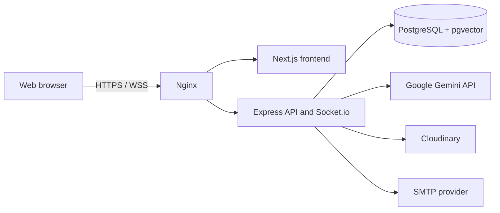

# Herbal AI System Design Document

## Project team and contribution allocation

| Member | Role | Primary contribution | Allocation |
|---|---|---|---:|
| Kevin C. Mercado | Project Manager; Backend Developer | Project planning and coordination; backend architecture; API, authentication, database, integration, testing, and technical documentation | 50% |
| Devon Descipulo | Backend Developer | Backend feature development; API/controller/repository support; database and integration support; testing | 25% |
| Eumar Cabaluna | Frontend Developer | Next.js interface development; responsive pages and components; frontend integration, usability, and UI testing | 25% |
| **Total** |  |  | **100%** |

Each member has an allocation above 20%. This allocation should be retained only if it accurately reflects the final team work record.

## 1. Purpose and scope

Herbal AI is a web platform for DOH-oriented Philippine medicinal-plant information, moderated community contributions, discussion, private messaging, and an AI assistant that retrieves knowledge-base context before generating responses. It is informational only and must not be represented as medical diagnosis or treatment.

## 2. Architecture

The frontend provides the web interface. Express exposes REST endpoints and Socket.io events. Prisma accesses PostgreSQL. Gemini supports embeddings and AI responses, Cloudinary stores uploaded images, and SMTP sends account/suggestion emails.

## 3. Component design

| Component | Responsibility |
|---|---|
| Next.js frontend | Pages for library, chat, suggestions, admin, forum, messenger, and account flows |
| Express API | Input validation, route handling, authentication, business rules, and error responses |
| Authentication service | Registration, login, password reset, email verification, token refresh, and OAuth support |
| Authorization middleware | Verifies JWT access tokens and restricts administrator actions by role |
| Herb and suggestion modules | DOH-oriented catalog, search, submissions, review, and publication workflow |
| Dr. Ai services | Gemini request handling and knowledge-base retrieval/embedding operations |
| Forum/message modules | Threads, comments, likes, persisted private messages, and real-time delivery |
| Audit/notification modules | Administrative action records and user notifications |

## 4. Data design

Core data entities are `User`, `Herb`, `SuggestedHerb`, `HerbComment`, `Thread`, `ThreadComment`, `Tag`, `ThreadTag`, `ChatMessage`, `Token`, `KnowledgeBase`, `AuditLog`, and `Notification`.

Important relationships:

- A user submits suggestions, posts community content, sends/receives messages, receives notifications, and may perform audited administrative actions.
- A herb has comments; comments can have nested replies and likes.
- A suggested herb is owned by a submitter and may be reviewed by an administrator.
- A knowledge-base entry stores a 768-dimension vector for semantic retrieval.
- A token belongs to one user and can be revoked.

## 5. Security design

- Passwords are hashed with bcrypt.
- API and Socket.io access use JWT validation; privileged routes require the admin role.
- Browser/API origins are controlled through `FRONTEND_URL` and credentialed CORS.
- Security headers disable `X-Powered-By` and set content/frame/referrer protections.
- Uploads are constrained by application validation; the SRS limits herb images to JPEG/PNG at 5 MB.
- Secrets are environment variables. Docker Compose now requires explicit `JWT_SECRET` and `JWT_REFRESH_SECRET`; it has no insecure fallback values.

## 6. Operational interfaces

| Interface | Purpose |
|---|---|
| `/api/test` | Basic backend health response |
| REST API under `/api` | Auth, herb, chat, suggestions, forum, messaging, notifications, statistics, audit, and knowledge-base operations |
| Socket.io | Real-time private-message and notification delivery |
| PostgreSQL 16 + pgvector | Relational data and vector search |

## 7. Known design decisions to verify

- Verify audit records after every admin mutation, not only audit-log access control.
- Verify that message Socket.io connections reject invalid tokens rather than merely omitting the private room.
- Confirm production CORS origin and cookie settings after deployment.
- Record external-service failure behavior for Gemini, SMTP, and Cloudinary.
